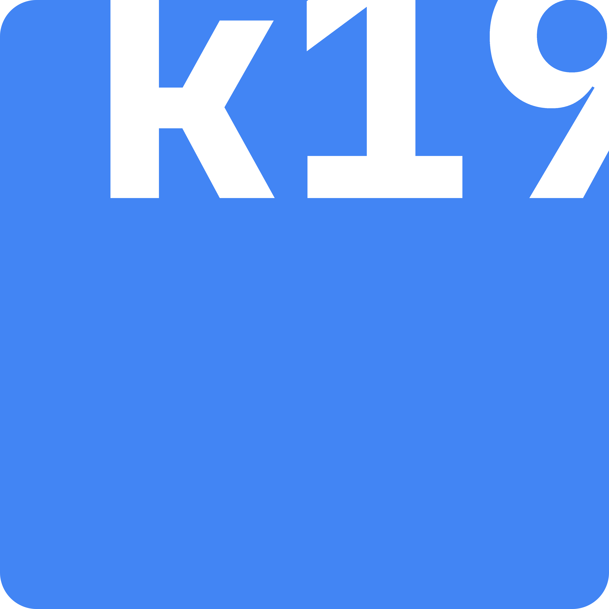
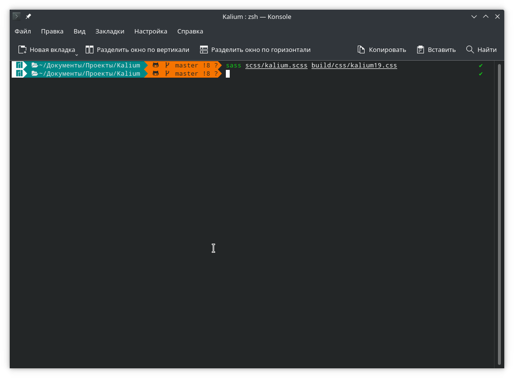
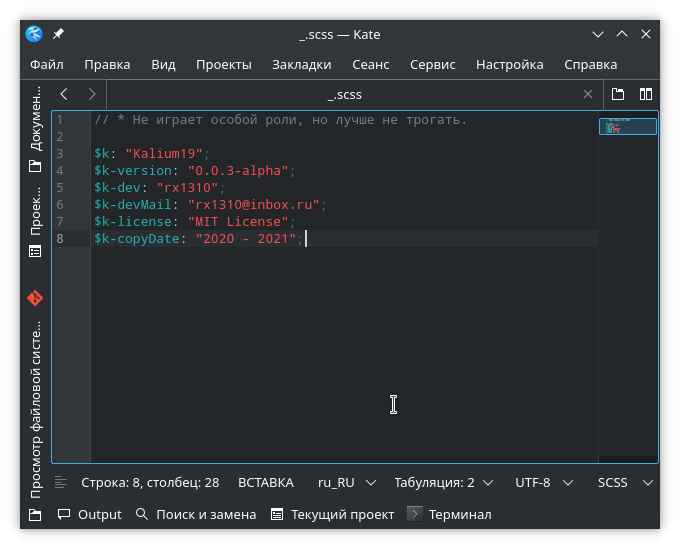

# Kalium19

[](https://github.com/rx1310/kalium19/blob/master/LICENSE)


[](https://github.com/rx1310/a2iga/commits/master)
[](https://github.com/rx1310/kalium19/graphs/contributors/)
[](https://github.com/rx1310/kalium19/discussions)

Небольшой UI-фреймворк, разрабатываемый для (себя) верстки небольших и простых веб-сайтов.

Kalium19 пишется для личного пользования и постоянно вносятся какие-то радикальные правки, а поэтому использовать на "продакшене" не стоит. Да и что тут использовать 🤷‍♂️

> Проект на этапе ~~разработки~~ прототипирования. Ничего сейчас не понятно, но что-то получается.

## Использование
Для начала напишу что никаких готовых CSS-файлов на каких-либо CDN (и подобных) нет и не будет (скорее всего). Сама идея фреймворка подразумевает предварительную настройку перед сборкой и использованием в проекте.

### Компиляция
Для начала, убедитесь в том, что у Вас установлен SASS версии не ниже 1.35.1 (проверить можно командой `sass --version`).
```
1.35.1 compiled with dart2js 2.13.3
```
> Использовании версии ниже может помешать компиляции стилей, ругаясь на `sass:math`. Рекомендуется обновить SASS если у Вас версия старше.

Если версия SASS соответствует рекомендации, то можно компилировать сами стили командой:

```
// Компиляция (сборка) стилей Kalium19
sass path/to/scss/kalium.scss path/to/output/css/kalium19.css
```

После компиляции у Вас должен появиться файл kalium19.css в папке, которую вы указали в терминале (*path/to/output/css/*). После необходимо лишь подключить CSS в HTML и всё.

### Скрипты
У Kalium19 есть один почти обязательный скрипт, который должен быть подключен если используется функционал смены темы сайта - **themeEngine.js**. Есть еще **cattrs.js**, но это не совсем обязательно, точнее вообще не обязательно.

&mdash; **[themeEngine.js](js/themeEngine.js)**: скрипт, позволяющий сменять тему сайта (светлая, темная, etc.).

Принцип работы скрипта очень прост. Вызывается функция `setTheme('theme-name')`, где `theme-name` в стоковом скрипте может быть заменен на `theme-dark` для темной темы и `theme-light` для светлой соответственно.

> Если на сайте предпологается использовать больше двух тем, то рекомендую ознакомиться с [этой](https://github.com/a2iga/a2iga.github.io/blob/main/assets/script/k19_themeEngine.js) версией скрипта.

Стили определяются в файле *[scss/_theme.scss](scss/_theme.scss)*.

Подключение скрипта осущ. либо в теге `<head>` либо в `<body>`:

```
<div class="group block">
	<button onclick="setTheme('theme-light')">Light</button>
	<button onclick="toggleTheme()">Toggle</button> <!-- Переключение темы с темной на светлую и наоборот -->
	<button onclick="setTheme('theme-dark')">Dark</button>
</div>

...

<script src="path/to/js/themeEngine.js"></script> <!-- можно прописать атрибут "defer" или "async" если скрипт загружается поздно -->
```

### Сетка Bootstrap
В Kalium19 была перенесена полноценная сетка из Bootstrap. Гайдов по сетке в интернете полно и поэтому расписывать о том, как ее использовать не буду.

Также, если сетка Bootstrap'а Вам не нужна, то закоментируйте в файле [kalium.scss](scss/kalium.scss) след. строчки:

```
// ? Twitter Bootstrap Grid (https://github.com/rx1310/workspace/tree/master/BootstrapGrid/SASS)
// @import '_grid/functions';
// @import '_grid/variables';
// @import '_grid/mixins/breakpoints';
// @import '_grid/mixins/grid-framework';
// @import '_grid/mixins/grid';
// @import '_grid/grid';
// @import '_grid/utilities/flex';
```

## _.scss
В каталоге *scss/* есть файл [_.scss](scss/_.scss), который никакой особой роли не играет, а просто содержит переменные для комментария в начале CSS с копирайтом и версией фреймворка, который выглядит примерно так:

```
/*! Kalium19 v0.0.3-alpha / Copyright (c) 2020 - 2021, rx1310 <rx1310@inbox.ru> / MIT License */
```
Если Вы решите форкнуть проект и использовать Kalium19 в своем проекте, то в файле [_.scss](scss/_.scss) просьба оставить переменные `$k`, `$k-version` и `$k-license` неизменными.



## Используемые материалы
При разработке Kalium19 я воспользовался след. инструментами и материалами:
- [SASS](https://sass-scss.ru/) (точнее SCSS) &ndash; это препроцессор, позволяющий писать код для стилей CSS, используя всевозможные: переменные, циклы, миксины, функции и многое другое.
- [Twitter Bootstrap](https://git.io/uBJdZg) &ndash; позаимствована сетка [Bootstrap Grid](https://git.io/JG2D7)
- [VanillaCoreX](https://git.io/JG2DX) &ndash; позаимствовано немного кода из прародителя CoreX (скрипт [themeEngine.js](https://git.io/JG2Dr))
- [Material Design Colors Palette](https://git.io/JG2yv)
- [Visual Studio Code](https://code.visualstudio.com/) &ndash; редактор кода

## Лицензия
Проект Kalium19 является проектом с открытым исходным кодом и распространяется по [лицензии MIT](LICENSE).
```
MIT License

Copyright (c) 2021 Haba Kudzaev (rx1310)

Permission is hereby granted, free of charge, to any person obtaining a copy
of this software and associated documentation files (the "Software"), to deal
in the Software without restriction, including without limitation the rights
to use, copy, modify, merge, publish, distribute, sublicense, and/or sell
copies of the Software, and to permit persons to whom the Software is
furnished to do so, subject to the following conditions:

The above copyright notice and this permission notice shall be included in all
copies or substantial portions of the Software.

THE SOFTWARE IS PROVIDED "AS IS", WITHOUT WARRANTY OF ANY KIND, EXPRESS OR
IMPLIED, INCLUDING BUT NOT LIMITED TO THE WARRANTIES OF MERCHANTABILITY,
FITNESS FOR A PARTICULAR PURPOSE AND NONINFRINGEMENT. IN NO EVENT SHALL THE
AUTHORS OR COPYRIGHT HOLDERS BE LIABLE FOR ANY CLAIM, DAMAGES OR OTHER
LIABILITY, WHETHER IN AN ACTION OF CONTRACT, TORT OR OTHERWISE, ARISING FROM,
OUT OF OR IN CONNECTION WITH THE SOFTWARE OR THE USE OR OTHER DEALINGS IN THE
SOFTWARE.
```
<br>
<center>1310.</center>